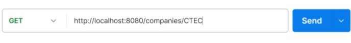
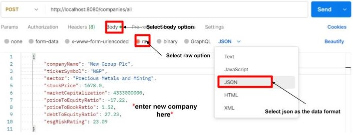
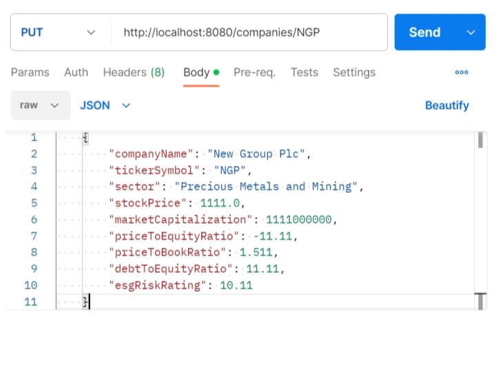

# **FTSE100 API**💵
Dive into this FTSE100 API created using SpringBoot!

## Description

Investing in stocks and shares is an effective way to make your money work for you without you physically being present. 
The FTSE100 (Financial Times Stock Exchange) is made up of the top 100 companies in the UK by market capitalization (total market value of all of a companies outstanding shares) and it is generally a good place to start when investing however, [popularity](https://www.cnbc.com/2019/01/04/good-companies-often-make-bad-investments-new-study-shows.html) should not be the main motivator for investing in a stock.

The aim of this API is to help users make an informed decision on which companies to invest in based on important valuation metrics. It uses a json file to store and retrieve data on financial metrics of all the companies in the FTSE100. 

## Data Model 

```java 
public class Ftse100 {
    private String companyName;
    private String tickerSymbol; 
    private String sector;
    private double stockPrice;
    private long marketCapitalization;
    private double priceToEquityRatio;
    private double priceToBookRatio;
    private double debtToEquityRatio;
    private double esgRiskRating;
}
```
- company name: Name of company in FTSE100
- ticker symbol: combination of letters used to uniquely identify publicly traded companies and the securities they issue
- sector: area of the economy in which a business operates
- stock price: the current value of a stock to buyers and sellers 
- market capitalization: total market value of all of a companies outstanding shares
- price to equity ratio: current share price relative to earnings per share 
- price to book ratio: market valuation of a company relative to its book value in order to identify a stock's potential value
- debt to equity ratio: how much debt a company is using to finance it's assets relative to the value of shareholder equity
- ESG risk rating: company's exposure to long-term environmental, social, and governance risks and how well a company is managing those risks. 


## Getting Started 

### Prerequisites

Before you begin, make sure you have the following installed:

1. [JDK 17](https://learn.microsoft.com/en-gb/java/openjdk/download#openjdk-17) (or higher)

2. [Git](https://git-scm.com/downloads)

3. [Visual Studio Code](https://code.visualstudio.com/Download)
   - [Extension Pack for Java](https://marketplace.visualstudio.com/items?itemName=vscjava.vscode-java-pack)
   - [Spring Boot Extension Pack](https://marketplace.visualstudio.com/items?itemName=vmware.vscode-boot-dev-pack)
4. [API Platform Postman](https://www.postman.com/downloads/) 


### Steps to Setup

#### 1. Open the terminal on VS Code, navigate to your desired repository and clone the Repository

```sh
cd [DIRECTORY_NAME]
git clone [REPO_URL]
cd [REPO_NAME]
```

- Replace [DIRECTORY_NAME] with the name of your directory
- Replace [REPO_URL] with the link to this GitHub repository 
- Replace [REPO_NAME] with the repository's name.

#### 2. Install Dependencies

At the root of the repo directory and run the following command to install the dependencies:

```sh
./mvnw clean dependency:resolve
```

If you are on a Windows machine, that will be:
```cmd
mvnw clean dependency:resolve
```

You should see console output similar to the following:

```sh
[INFO] Scanning for projects...
[INFO] 
[INFO] -------------------< com.cbfacademy:api-assessment >--------------------
[INFO] Building api-assessment 0.0.1-SNAPSHOT
[INFO]   from pom.xml
[INFO] --------------------------------[ jar ]---------------------------------
[INFO] 
[INFO] --- clean:3.2.0:clean (default-clean) @ api-assessment ---
[INFO] Deleting /Users/user/Dev/cbfacademy/java-api-assessment/target
...
[truncated output]
...
[INFO] ------------------------------------------------------------------------
[INFO] BUILD SUCCESS
[INFO] ------------------------------------------------------------------------
[INFO] Total time:  3.060 s
[INFO] Finished at: 2023-10-03T16:18:25+01:00
[INFO] ------------------------------------------------------------------------
```

#### 3. Running the Application

To start the API in VS Code, press `F5` or tap the *Run* option located above the main method in the *App.java* file: 
```java 
	  	public static void main(String[] args) {
		SpringApplication.run(App.class, args);
	}
```

Alternatively, to start the API from the terminal, run the following command:

```sh
./mvnw spring-boot:run
```

Or on Windows:

```cmd
mvnw spring-boot:run
```

You should see console output similar to the following (press `Ctrl + C` to exit):

```sh
[INFO] Scanning for projects...
[INFO] 
[INFO] -------------------< com.cbfacademy:api-assessment >--------------------
[INFO] Building api-assessment 0.0.1-SNAPSHOT
[INFO]   from pom.xml
[INFO] --------------------------------[ jar ]---------------------------------
[INFO] 
[INFO] --- clean:3.2.0:clean (default-clean) @ api-assessment ---
[INFO] Deleting /Users/gary/Dev/cbfacademy/java-api-assessment/target
[INFO] 
[INFO] >>> spring-boot:3.1.4:run (default-cli) > test-compile @ api-assessment >>>
[INFO] 
[INFO] --- resources:3.3.1:resources (default-resources) @ api-assessment ---
[INFO] Copying 1 resource from src/main/resources to target/classes
[INFO] Copying 0 resource from src/main/resources to target/classes
...
[truncated output]
...
2023-10-03T17:17:34.413+01:00  INFO 35536 --- [  restartedMain] .e.DevToolsPropertyDefaultsPostProcessor : For additional web related logging consider setting the 'logging.level.web' property to 'DEBUG'
2023-10-03T17:17:34.751+01:00  INFO 35536 --- [  restartedMain] o.s.b.w.embedded.tomcat.TomcatWebServer  : Tomcat initialized with port(s): 8080 (http)
2023-10-03T17:17:34.756+01:00  INFO 35536 --- [  restartedMain] o.apache.catalina.core.StandardService   : Starting service [Tomcat]
2023-10-03T17:17:34.756+01:00  INFO 35536 --- [  restartedMain] o.apache.catalina.core.StandardEngine    : Starting Servlet engine: [Apache Tomcat/10.1.13]
2023-10-03T17:17:34.777+01:00  INFO 35536 --- [  restartedMain] o.a.c.c.C.[Tomcat].[localhost].[/]       : Initializing Spring embedded WebApplicationContext
2023-10-03T17:17:34.778+01:00  INFO 35536 --- [  restartedMain] w.s.c.ServletWebServerApplicationContext : Root WebApplicationContext: initialization completed in 364 ms
2023-10-03T17:17:34.898+01:00  INFO 35536 --- [  restartedMain] o.s.b.d.a.OptionalLiveReloadServer       : LiveReload server is running on port 35729
2023-10-03T17:17:34.907+01:00  INFO 35536 --- [  restartedMain] o.s.b.w.embedded.tomcat.TomcatWebServer  : Tomcat started on port(s): 8080 (http) with context path ''
2023-10-03T17:17:34.911+01:00  INFO 35536 --- [  restartedMain] com.cbfacademy.apiassessment.App         : Started App in 0.643 seconds (process running for 0.786)
```

4. The application can now be accessed at a base URL of [http://localhost:8080]() with the relevant end points appended to this URL

## Documentation 
Whilst the application is running, all documentation and operational end points can be seen at:
[Ftse100 API Documentation](http://localhost:8080/swagger-ui-ftse100.html)
<br>

**NOTE**: The ftse-100-rest-template-controller is a syncronous client to perform HTTP requests. Feel free to use either sets of end points to make requests to this API. 


## End Points
All application end points can be accessed and used through the API platform Postman 
<br> 

#### Add new request


#### Select request type and enter URL for the end point 


## Example HTTP requests
#### GET a company by it's ticker symbol



Response Body:

```json
{
    "companyName": "ConvaTec Group Plc",
    "tickerSymbol": "CTEC",
    "sector": "Medical Equipment and Services",
    "stockPrice": 201.08,
    "marketCapitalization": 4554000000,
    "priceToEquityRatio": 67.67,
    "priceToBookRatio": 3.11,
    "debtToEquityRatio": 90.12,
    "esgRiskRating": 16.6
}
```
HTTP Response Status: 200 OK

### POST a new company to the list of companies


Response Body: 
```json 
    {
        "companyName": "New Group Plc",
        "tickerSymbol": "NGP",
        "sector": "Precious Metals and Mining",
        "stockPrice": 1678.0,
        "marketCapitalization": 4333000000,
        "priceToEquityRatio": -17.22,
        "priceToBookRatio": 1.52,
        "debtToEquityRatio": 27.23,
        "esgRiskRating": 23.09
    }
```
HTTP Response Status: 201 Created

### UPDATE a companies finanacial metrics


Response Body:

```json 
    {
        "companyName": "New Group Plc",
        "tickerSymbol": "NGP",
        "sector": "Precious Metals and Mining",
        "stockPrice": 1111.0,
        "marketCapitalization": 1111000000,
        "priceToEquityRatio": -11.11,
        "priceToBookRatio": 1.511,
        "debtToEquityRatio": 11.11,
        "esgRiskRating": 10.11
    }
```
HTTP Response Status: 200 OK


### DELETE a company from the list of companies


Response Body:
```json
Json array of companies objects without the company you just deleted
[{
    "companyName": "String",
    "tickerSymbol": "String",
    "sector": "String",
    "stockPrice": 0,
    "marketCapitalization": 0,
    "priceToEquityRatio": 0,
    "priceToBookRatio": 0,
    "debtToEquityRatio": 0,
    "esgRiskRating": 0
}]
```
HTTP Response Status: 200 OK

## Error Handling 
When making requests to this API, you may come across some error responses due to an incorrect end point. Never fear, you will be guided as to why this might be the case. 

#### Company does not exist

| HTTP Request  | End point  |
| ------------- | ------------- |
| GET   | /{tickerSymbol}  |
| GET   | stockPrices/{tickerSymbol}  |
| PUT |  /{tickerSymbol}  |
| DELETE |  /{tickerSymbol}  |

For the end points listed above, if a ticker symbol is entered for a company that doesn't exist, you will encounter an error. Here is an example with the error response below:


```json 
{
"errorCode": 404,
"message": "No FTSE100 company present with Ticker Symbol: NGP"
}
```

#### Company already exists 

| HTTP Request  | End point  |
| ------------- | -----------|
| POST   | /all |

For the end point listed above, if a ticker symbol is entered for a company that already exists, you will encounter an error. Here is an example with the error response below:


```json 
{
"errorCode": 403,
"message": "FTSE100 company already present with Ticker Symbol: EDV"
}
```
### **Happy requesting!** 🚀